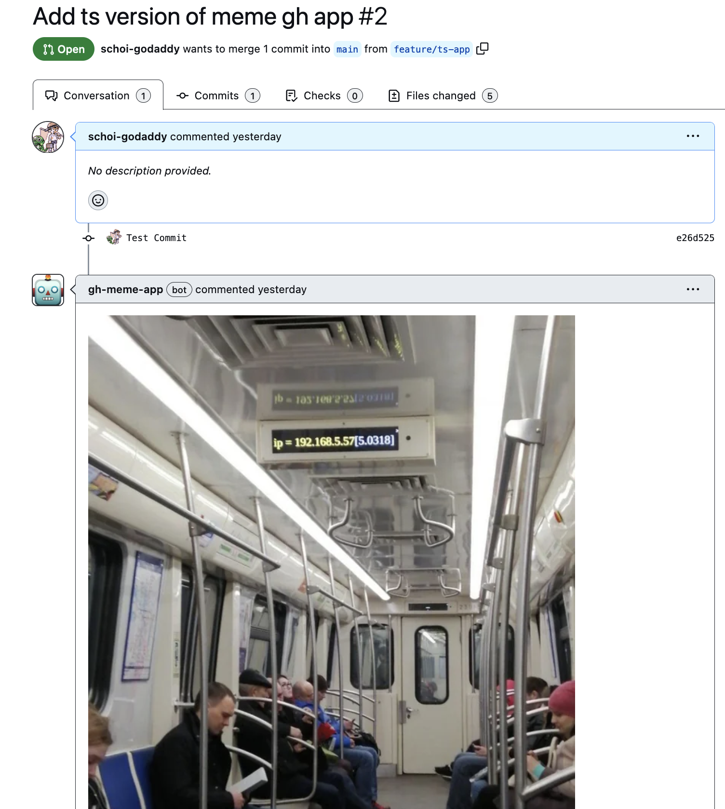

# template-github-app-typescript

template-github-app-typescript

Basic github-app typescript template for demo purpose.

## 🎯 Goal

Build PR meme generator github action. When someone **creates** a PR, our app will **post meme comment**.

On purposely not using [probot](https://probot.github.io/docs/README/) to demonstrate bit of internal details.



## 💻 Instruction

1. Navigate to https://smee.io/ click "Start a new channel".
1. Create `.env` based on `.env.example`
   ```bash
   cp .env.example .env
   ```
1. Create a new GitHub App. [Reference](https://docs.github.com/en/apps/creating-github-apps/creating-github-apps/creating-a-github-app)
   - For "Webhook URL", use URL you got from above `smee.io` channel.
   - Download private key (`pem`) once app is created.
1. Fill in necessary info in `.env` you created.
1. Prepare development by installing packages.
   ```bash
   npm i
   ```
1. Navigate to [index.ts](./index.ts) to get started with coding.
1. Once ready, run `npm start` in Terminal A, to start GitHub App Webhook API.

   ```bash
   $ npm start

   ...
   > nodemon index.ts

   ...
   Express Server running at :3333 🚀
   ```

1. Once ready, run `smee-client` in Terminal B, to channel smee -> localhost connection.
   ```bash
   npx smee-client -u <REPLACE_WITH_YOUR_SMEE_URL> --port <REPLACE_WITH_YOUR_ENV_PORT>
   ```
1. Install the application you created on an account level.
1. Test integration by creating PR.
1. Add Webhook secret validation using `verify` in `index.ts`.
   - Utilize command like `openssl rand -base64 33`
